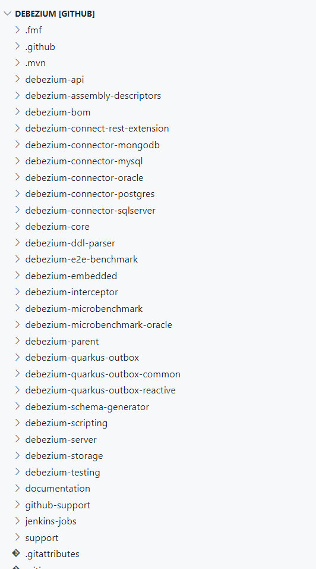

# 企业级依赖管理: 深入解读 Maven BOM

#  一、背景


当开发者在一个大型项目中使用 Maven 进行依赖管理时，项目往往会包含多个模块或子项目，并且这些模块会共享相同的依赖项。但是，不同模块可能会独立地指定各自的依赖版本，这可能导致以下问题：

1. **依赖版本不一致：** 不同模块中对相同依赖项使用不同的版本号，可能导致潜在的兼容性问题或冲突。
2. **版本管理困难：** 在多个模块中管理和维护依赖版本的一致性可能变得复杂，因为需要手动确保每个模块中的依赖版本保持同步。
3. **重复配置：** 在每个模块中单独指定依赖项的版本，导致了大量的重复配置，增加了维护成本。

为解决以上问题，Maven BOM（Bill of Materials，依赖关系管理）被引入，提供了一种集中管理依赖版本的方法。

---


此时有些同学可能会有疑问：我可以在项目的根pom中通过`<dependencyManagement>` 标签来集中化管理项目的所有依赖啊。

诚然，当项目使用 Maven 的 `dependencyManagement` 标签集中管理依赖时，确实能够集中指定依赖版本，但这种方式并不能将该项目的依赖版本供其他项目使用；相信大家对springboot并不陌生，在使用springboot的开发过程中我们通常可以看到如下依赖：

```xml
<!--引入Spring Boot官方维护的bom依赖清单-->
<dependency>
    <groupId>org.springframework.boot</groupId>
    <artifactId>spring-boot-dependencies</artifactId>
    <version>2.6.3</version>
    <type>pom</type>
    <scope>import</scope>
</dependency>
<!--引入阿里依赖bom清单-->
<dependency>
  <groupId>com.alibaba.cloud</groupId>
  <artifactId>aliyun-spring-boot-dependencies</artifactId>
  <version>1.0.0</version>
  <type>pom</type>
  <scope>import</scope>
</dependency>
```

Spring Boot BOM（Bill of Materials，依赖关系管理）的优势在于，它不仅集中管理依赖版本，还允许其他项目通过引用 Spring Boot BOM 来继承其依赖版本管理的功能。换句话说，其他项目可以直接引入 Spring Boot BOM，继承其所管理的依赖版本，而无需单独指定每个依赖的版本。

相比之下，普通的 Maven 项目中，使用 `dependencyManagement` 标签虽然能够在当前项目中集中管理依赖版本，但其他项目无法直接继承该管理依赖版本的配置，需要手动复制相应的依赖管理部分到其他项目中，这样会增加维护成本且可能出现版本不一致的问题。


# 二、什么是BOM

Maven 项目的打包类型时，通常可以分为三种：

1. **jar：** 这是最常见的打包类型，适用于普通的 Java 项目。项目会以 jar 类型的格式进行打包。
2. **pom：** 这种类型的项目通常被用作多模块项目的管理和维护。在父模块中定义了依赖项、插件等内容，实现了对版本的统一维护管理。
3. **war：** 这类项目打包成为可运行的 Java Web 项目，例如可以在诸如 Tomcat、Jetty 等应用服务器上运行。

BOM 实际上是一个以 POM 类型定义的普通 Maven 项目，主要用于维护描述 Maven 项目所需的一系列公共依赖信息。通过引用 BOM 项目，可以实现对依赖版本的统一维护管理，而无需明确指定每个依赖项的版本号。


---

**BOM 文件结构定义结构**

```xml
<parent>
    <groupId>org.example</groupId>
    <artifactId>maven-bom-examples</artifactId>
    <version>${revision}</version>
</parent>
<!--pom类型，多模块中依赖统一管理维护-->
<packaging>pom</packaging>
<artifactId>example-bom</artifactId>

<properties>
    <!--统一维护管理变量-->
</properties>

<dependencyManagement>
    <dependencies>
        <!--统一维护管理的依赖-->
    </dependencies>
</dependencyManagement>

<build>
    <pluginManagement>
        <plugins>
            <!--插件依赖统一管理-->
        </plugins>
    </pluginManagement>
</build>
```


# 三、使用指南

## 3.1、创建bom


当创建 BOM（Bill Of Materials，物料清单）时，常见的两种方式包括：

1. **单独仓库存放依赖：** 在一个专门的仓库中，建立 BOM 模块用于存放特定需求的依赖信息。这种方法适用于需要隔离和管理独立的依赖需求，确保依赖版本独立于其他项目。
2. **应用内创建 BOM 模块：** 在现有应用的仓库中创建 BOM 模块，让应用的所有子模块共享使用。这种方法适用于在应用内统

选择使用哪种方式创建 BOM 取决于需求的特点和项目的架构，本文参考[aliyun-spring-boot](https://github.com/alibaba/aliyun-spring-boot) 实现方式，即应用内创建BOM模块。

---


新建一个`maven-bom-examples`项目，其目录结构如下：

```
maven-bom-examples
├─.idea
├─example-bom
│  └─pom.xml
└─pom.xml
```

`example-bom`模块pom.xml文件如下：

```xml
<parent>
    <groupId>org.example</groupId>
    <artifactId>maven-bom-examples</artifactId>
    <version>${revision}</version>
</parent>
<!-- pom类型 -->
<packaging>pom</packaging>
<artifactId>example-bom</artifactId>

<properties>
    <mysql.connector.java.version>8.0.33</mysql.connector.java.version>
    <lingxi.cas.starter.version>1.1.4-RELEASE</lingxi.cas.starter.version>
    <!-- 等等 -->
</properties>

<dependencyManagement>
    <dependencies>
        <dependency>
            <groupId>mysql</groupId>
            <artifactId>mysql-connector-java</artifactId>
            <version>${mysql.connector.java.version}</version>
        </dependency>
        <dependency>
            <groupId>com.qihoo.finance.lingxi</groupId>
            <artifactId>lingxi-cas-starter</artifactId>
            <version>${lingxi.cas.starter.version}</version>
        </dependency>
        <!-- 等等 -->
    </dependencies>
</dependencyManagement>

<build>
    <pluginManagement>
        <plugins>
            <plugin>
                <!-- 等等 -->
            </plugin>
        </plugins>
    </pluginManagement>
</build>

</project>
```


## 3.2、错误使用：循环依赖

为了`maven-bom-examples`后续创建新的子模块可以使用bom的统一依赖，传统方式应该是将`example-bom`的GAV坐标放在`maven-bom-examples`的`<dependencyManagement>`依赖标签中，从而作用于后续的子模块，pom如下：

```xml
<groupId>org.example</groupId>
<artifactId>maven-bom-examples</artifactId>
<version>${revision}</version>
<packaging>pom</packaging>
<modules>
    <module>example-bom</module>
</modules>

<properties>
    <revision>1.0.0-SNAPSHOT</revision>
    <maven.compiler.source>8</maven.compiler.source>
    <maven.compiler.target>8</maven.compiler.target>
    <project.build.sourceEncoding>UTF-8</project.build.sourceEncoding>
</properties>

<dependencyManagement>
    <dependencies>
        <dependency>
            <groupId>org.example</groupId>
            <artifactId>example-bom</artifactId>
            <version>${revision}</version>
            <type>pom</type>
            <scope>import</scope>
        </dependency>
    </dependencies>
</dependencyManagement>

</project>
```


然而这种做法会导致项目打包报错，如下：循环依赖

```shell
> mvn clean install
[ERROR]   The project org.example:maven-bom-examples:1.0.0-SNAPSHOT (D:\IdeaProjects\maven-bom-examples\pom.xml) has 1 error
[ERROR]   The dependencies of type=pom and with scope=import form a cycle: org.example:example-bom:1.0.0-SNAPSHOT -> org.example:example-bom:1.0.0-SNAPSHOT @ org.example:example-bom:1.0.0-SNAPSHOT
```


导致循环依赖的原因在于：`maven-bom-examples`的POM 是以 `type=pom` 和 `scope=import` 的方式导入`example-bom`的pom，而`example-bom`的pom又依赖于父pom，即`maven-bom-examples`，因而形成了循环依赖导致maven报错；需要注意的是如果依赖的是jar包类型的子模块则不会有循环依赖问题，

例如新增一个`example-api`子模块，此时目录结构如下：

```shell
maven-bom-examples
├─.idea
├─example-api
│  └─src
│  └─pom.xml
├─example-bom
│  └─pom.xml
└─pom.xml
```

`maven-bom-examples`pom新增example-api依赖，更改如下：

```xml
<dependencyManagement>
    <dependencies>
<!--            <dependency>-->
<!--                <groupId>org.example</groupId>-->
<!--                <artifactId>example-bom</artifactId>-->
<!--                <version>${revision}</version>-->
<!--                <type>pom</type>-->
<!--                <scope>import</scope>-->
<!--            </dependency>-->
        <dependency>
            <groupId>org.example</groupId>
            <artifactId>example-api</artifactId>
            <version>${revision}</version>
        </dependency>
    </dependencies>
</dependencyManagement>
```


此时打包正常，可以看到`example-api`与`example-bom` 处于同级目录，却只有`example-bom` 出现了循环依赖，这根本原因便在于`<scope>import</scope>`标签；以当前项目为例，当根pom引用了 `<scope>import</scope>` 的 BOM 时，而这个 BOM 又包含了指向根 POM 的依赖，就会导致循环依赖的问题。

而`example-api`模块为普通jar包模块故不会导致循环依赖问题。


## 3.3、正确使用

正确的使用方式是创建一个名为 `example-parent` 模块，使其与 `example-bom`处于同级目录下，并在 `example-parent` 模块中导入 BOM 的依赖。然后，其他子模块只需引入 `example-parent` 模块作为其父模块，从而实现对 BOM 依赖的继承。此时目录结构如下：

```
maven-bom-examples
├─.idea
├─example-api
│  └─src
│  └─pom.xml
├─example-parent
│  └─pom.xml
├─example-bom
│  └─pom.xml
└─pom.xml
```

`example-parent` pom如下：由于`example-parent` 与 `example-bom`处于同级目录下，故不会出现循环依赖问题。

```xml
<parent>
    <groupId>org.example</groupId>
    <artifactId>maven-bom-examples</artifactId>
    <version>${revision}</version>
</parent>
<packaging>pom</packaging>
<artifactId>example-parent</artifactId>

<properties>
    <maven.compiler.source>8</maven.compiler.source>
    <maven.compiler.target>8</maven.compiler.target>
    <project.build.sourceEncoding>UTF-8</project.build.sourceEncoding>
</properties>

<dependencyManagement>
    <dependencies>
        <dependency>
            <groupId>org.example</groupId>
            <artifactId>example-bom</artifactId>
            <version>${revision}</version>
            <type>pom</type>
            <scope>import</scope>
        </dependency>
    </dependencies>
</dependencyManagement>

</project>
```

`maven-bom-examples`pom：无依赖

```xml
<groupId>org.example</groupId>
<artifactId>maven-bom-examples</artifactId>
<version>${revision}</version>
<packaging>pom</packaging>
<modules>
    <module>example-bom</module>
    <module>example-api</module>
    <module>example-parent</module>
</modules>

<properties>
    <revision>1.0.0-SNAPSHOT</revision>
    <maven.compiler.source>8</maven.compiler.source>
    <maven.compiler.target>8</maven.compiler.target>
    <project.build.sourceEncoding>UTF-8</project.build.sourceEncoding>
</properties>

</project>
```


## 3.4、创建子模块

由于 `example-parent` 模块引入了 BOM 依赖，因此，若要在后续的子模块中使用统一的依赖管理，只需要在 `example-parent` 父模块下创建相应的子模块即可实现统一依赖的继承。例如新建`example-model`，此时目录结构如下：

```
maven-bom-examples
├─.idea
├─example-api
│  ├─src
│  └─pom.xml
├─example-parent  
│  ├─example-model
│  │  ├─src
│  │  └─pom.xml
│  └─pom.xml
├─example-bom
│  └─pom.xml
└─pom.xml
```

`example-parent`pom如下：

```xml
<parent>
    <groupId>org.example</groupId>
    <artifactId>maven-bom-examples</artifactId>
    <version>${revision}</version>
</parent>
<packaging>pom</packaging>
<artifactId>example-parent</artifactId>

<modules>
    <!-- 新增子模块 -->
    <module>example-model</module>
</modules>

<properties>
    <maven.compiler.source>8</maven.compiler.source>
    <maven.compiler.target>8</maven.compiler.target>
    <project.build.sourceEncoding>UTF-8</project.build.sourceEncoding>
</properties>

<dependencyManagement>
    <dependencies>
        <dependency>
            <groupId>org.example</groupId>
            <artifactId>example-bom</artifactId>
            <version>${revision}</version>
            <type>pom</type>
            <scope>import</scope>
        </dependency>
    </dependencies>
</dependencyManagement>
```

`example-model`pom如下：

```xml
<parent>
    <groupId>org.example</groupId>
    <artifactId>example-parent</artifactId>
    <version>${revision}</version>
</parent>

<artifactId>example-model</artifactId>

<properties>
    <maven.compiler.source>8</maven.compiler.source>
    <maven.compiler.target>8</maven.compiler.target>
    <project.build.sourceEncoding>UTF-8</project.build.sourceEncoding>
</properties>

<dependencies>
    <!-- 子模块使用了bom依赖而无需指定version -->
    <dependency>
        <groupId>mysql</groupId>
        <artifactId>mysql-connector-java</artifactId>
    </dependency>
    <dependency>
        <groupId>com.qihoo.finance.lingxi</groupId>
        <artifactId>lingxi-cas-starter</artifactId>
    </dependency>
</dependencies>
```


## 3.5、扩展：`<relativePath>`

`<relativePath>` 元素是 Maven POM 文件中 `<parent>` 元素的一个子元素，用于指定父模块相对于当前子模块的路径，它告诉 Maven 在哪里找到父 POM，如下：

```xml
<parent>
    <groupId>xxx</groupId>
    <artifactId>xxx</artifactId>
    <version>xxx</version>
    <relativePath>../xxx/pom.xml</relativePath>
</parent>
```

这个元素通常在子模块的 POM 文件中用于指定父 POM 文件的路径，以便在项目中更灵活地管理父子模块之间的关系。

如果父模块就在当前项目的根目录下，则不需要指定 `<relativePath>` 元素，例如上面的`example-model`子模块就无需使用`<relativePath>` 标签。

之所以要介绍`<relativePath>` 标签是因为有时我们为了更直观的查看所有应用模块而将所有子模块全部放在根目录下，例如开源项目debezium：



此时新增example-relative子模块，目录结构如下：

```
maven-bom-examples
├─.idea
├─example-api
│  ├─src
│  └─pom.xml
├─example-parent  
│  ├─example-model
│  │  ├─src
│  │  └─pom.xml
│  └─pom.xml
├─example-bom
│  └─pom.xml
├─example-relative
│  ├─src
│  └─pom.xml
└─pom.xml
```


`example-relative`pom：

```xml
<parent>
    <groupId>org.example</groupId>
    <artifactId>example-parent</artifactId>
    <version>${revision}</version>
    <!-- 由于与example-parent同级目录, 使用relativePath标签指定父POM路径 -->
    <relativePath>../example-parent/pom.xml</relativePath>
</parent>

<artifactId>example-relative</artifactId>

<properties>
    <maven.compiler.source>8</maven.compiler.source>
    <maven.compiler.target>8</maven.compiler.target>
    <project.build.sourceEncoding>UTF-8</project.build.sourceEncoding>
</properties>

<dependencies>
    <!-- 子模块无需指定version, 而是使用了bom依赖 -->
    <dependency>
        <groupId>mysql</groupId>
        <artifactId>mysql-connector-java</artifactId>
    </dependency>
</dependencies>
```

`example-parent`pom：

```xml
<parent>
    <groupId>org.example</groupId>
    <artifactId>maven-bom-examples</artifactId>
    <version>${revision}</version>
</parent>
<packaging>pom</packaging>
<artifactId>example-parent</artifactId>

<modules>
    <module>example-model</module>
    <!-- 新增子模块 -->
    <module>../example-relative</module>
</modules>

<properties>
    <maven.compiler.source>8</maven.compiler.source>
    <maven.compiler.target>8</maven.compiler.target>
    <project.build.sourceEncoding>UTF-8</project.build.sourceEncoding>
</properties>

<dependencyManagement>
    <dependencies>
        <dependency>
            <groupId>org.example</groupId>
            <artifactId>example-bom</artifactId>
            <version>${revision}</version>
            <type>pom</type>
            <scope>import</scope>
        </dependency>
    </dependencies>
</dependencyManagement>
```


# 四、总结

当涉及到大型项目和多模块应用时，Maven BOM（Bill of Materials）提供了一种管理依赖版本的强大机制。通过创建BOM可以：

- 集中管理依赖的版本号，确保各模块使用相同的依赖版本。
- 减少版本冲突和不一致性的问题，提高项目的稳定性和可靠性。
- 允许其他项目引用BOM并继承其依赖版本，减少重复配置的需求，提高项目的可维护性和一致性。

深入理解和有效使用Maven BOM有助于简化依赖管理过程，提高项目的开发效率和整体质量。


# 五、相关资料

- [debezium](https://github.com/debezium/debezium)
- [aliyun-spring-boot-parent](https://github.com/alibaba/aliyun-spring-boot)
